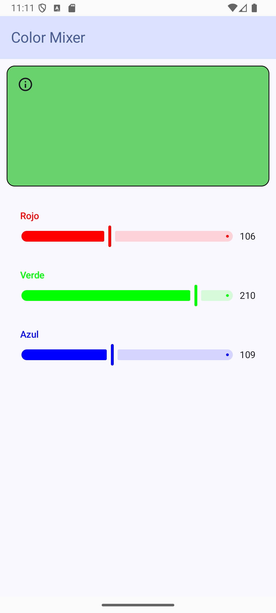
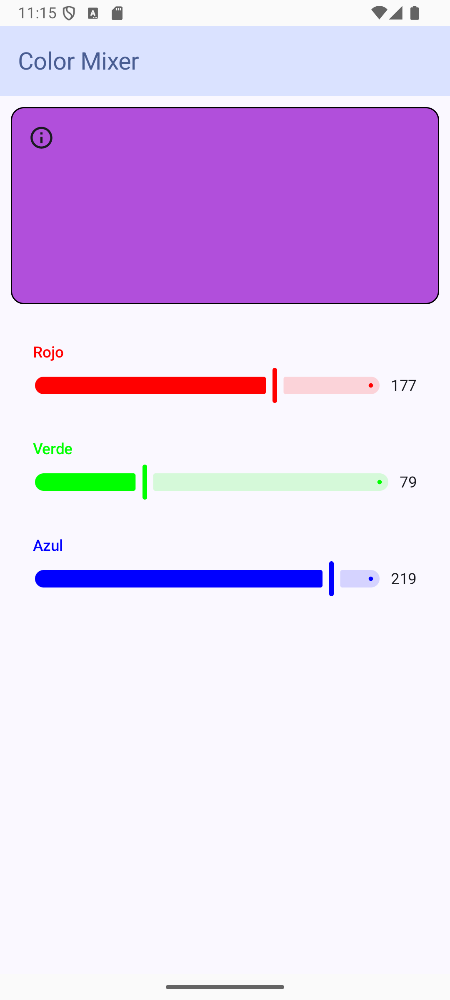

# 🎨 ColorMixer

**ColorMixer** is a simple and interactive Android application built using **Jetpack Compose**. It allows users to create custom colors by adjusting RGB sliders and instantly view the resulting color.

## Features

- Modern UI with Material 3 design
- Three sliders to control Red, Green, and Blue components
- Real-time color preview

---

## Screenshots





---

### Running the App Locally

1. **Clone this repository:**

```bash
git clone https://github.com/your-username/ColorMixer.git
```

## Short Demo Video

[Color Mixer App Demo](https://drive.google.com/file/d/1s9CN3MtU33MvpCd3ToNQYRFof1Isotwg/view?usp=sharing)
